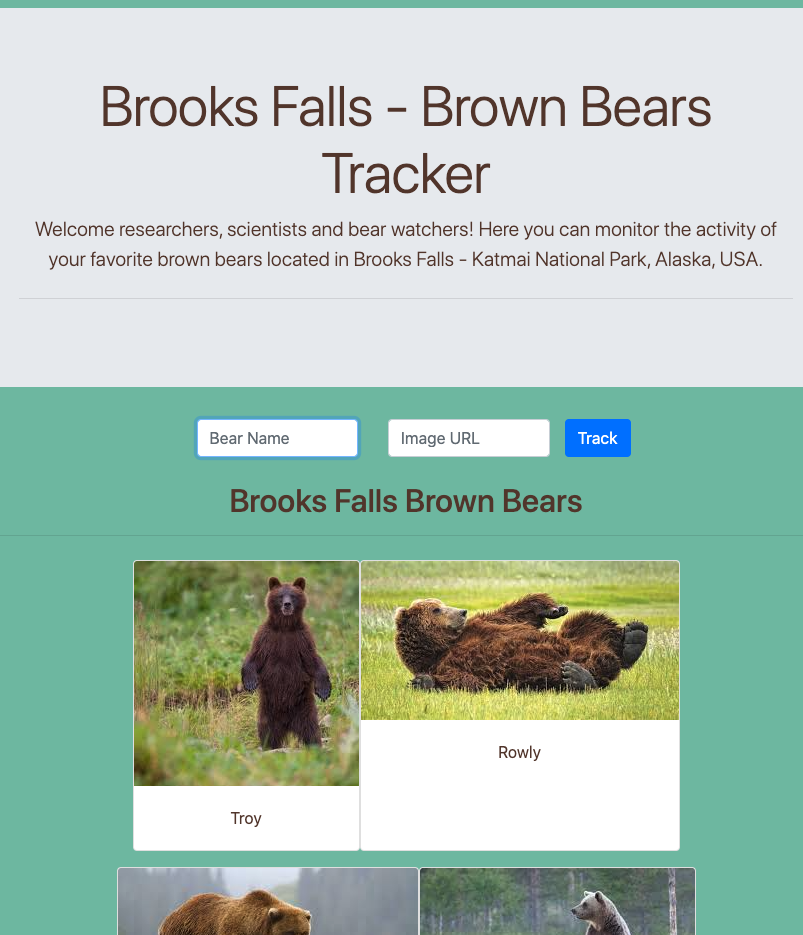

# Brooks Falls - Brown Bears Tracker
  This site allows you to track brown bears in Katmai National Park, Alaska. You can add a new bear to track and view the current bears being tracked as well.
### Link to your wireframes/prototype
  [Wireframe](https://www.figma.com/file/fgmKnToAG9vPIJkxl7Ikf5/Untitled?node-id=0%3A1)
### Link to the deployed project
  [Deployed Project](https://mg-bear-tracking-app.netlify.app)
### Link to your project board
  [Project Board](https://github.com/GonzalesMatthew/ASSIGNMENT-Bear-Watcher/projects/1)
### Description of the user
  For researchers and scientists to keep track of their favorite bears in the area.
### List of features                                                
  Form to track more bears, ability to view all bears on cards, responsive design. More features to come: ability to track fish caught per bear, see who caught the most fish!, top bears by fish caught: rankings 1st, 2nd, 3rd
### Screenshots of your project

### List of contributors and links to their GH profiles
@GonzalesMatthew
### Link to Loom video walkthrough of your app
[App-Walkthrough Video](https://www.loom.com/share/01917e55658a4d34a08381208489cf11)
